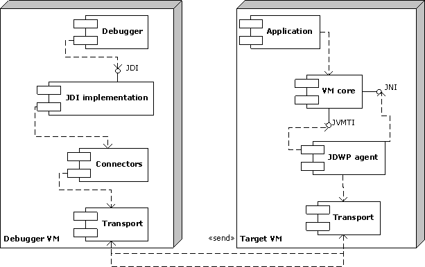

# JAVA IDE代码调试原理浅析


当你用IDA进行代码调试的时候发生了什么？为什么打个断点代码运行就能在这里停住？条件断点是怎么实现的？本文将从宏观说明其实现方式，点到为止。


可以看一下点击debug之后IDE的启动命令

```
java -agentlib:jdwp=transport=dt_socket,address=127.0.0.1:61353,suspend=y,server=n -javaagent:/Users/zlb/Library/Caches/JetBrains/IntelliJIdea2021.2/captureAgent/debugger-agent.jar -Dfile.encoding=UTF-8 -classpath /Users/zlb/IdeaProjects/learn/out/production/learn:/Applications/IntelliJ IDEA.app/Contents/lib/idea_rt.jar wk
Connected to the target VM, address: '127.0.0.1:61353', transport: 'socket'
```

* transport ： 传输方式，有 socket (dt\_socket)和 shared memory(dt\_shmem)
* server（y/n）： 是主动连接调试器还是作为服务器等待调试器连接
* address： 调试服务器的端口号，客户端用来连接服务器的端口号
* suspend（y/n）：值是 y 或者 n，若为 y，启动时候自己程序的 VM 将会暂停（挂起），直到客户端进行连接，若为 n，自己程序的 VM 不会挂起&#x20;

若有异议，可以直接看官方文档那个，非常详细：[官方文档-Connection and Invocation Details](https://docs.oracle.com/en/java/javase/14/docs/specs/jpda/conninv.html)

### Java Debug Wire Protocol

首先要明白什么是 `JDWP`(Java Debug Wire Protocol) java调试线协议，用来：

> The Java Debug Wire Protocol (JDWP) is the protocol used for communication between a debugger and the Java virtual machine (VM) which it debugs (hereafter called the target VM). JDWP is optional; it might not be available in some implementations of the JDK. The existence of JDWP can allow the same debugger to work
>
> * in a different process on the same computer, or
> * on a remote computer,

JDWP是调试器和java虚拟机之间用来调试交流的一种协议。可以用来对远程主机或者一台电脑上的两个进程之间进行交互。你想啊，通过IDE进行debug肯定是需要IDE与JVM进行交互，来设置断点啊，获取变量信息啊等等。下面是官方的文档，包括介绍和协议的格式等。

* [Java Debug Wire Protocol](https://docs.oracle.com/javase/8/docs/technotes/guides/jpda/jdwp-spec.html)

### **Java Debug Interface**

> * **Java Debug Interface** (**JDI**) - a high-level API used by a debugger to debug Java applications in a target JVM
>   * **JDI Connectors and Transports** - an auxiliary API for attaching to a target JVM in different ways using different transport channels from the debugger side
> * **Java Debug Wire Protocol** (**JDWP**) - a specification of a protocol used for communication between the debugger and the JDWP agent loaded into the JVM process
>   * **JDWP Transport Interface** - an auxiliary API that specifies way to use different transport channels from the JDWP agent side
> * **Java Virtual Machine Tool Interface** (**JVMTI**) - a low-level API exposed by a JVM to a JDWP agent (or any other agent) to control execution of a running Java[\*](https://svn.apache.org/repos/asf/harmony/enhanced/java/trunk/jdktools/modules/jpda/doc/JDWP\_agent.htm#\*) application and provide access to its data

我们直接去操作的是JDI(Java Debug Interface),用来屏蔽底层复杂的细节。`com.sun.jdi`是官方提供的debug工具包,下面两篇文章是用该工具包进行debug的示例，比较易懂：

[Java 调试接口 API (JDI) – Hello World示例|适合初学者的编程调试](https://itsallbinary.com/java-debug-interface-api-jdi-hello-world-example-programmatic-debugging-for-beginners/)

[Java 调试接口 API (JDI) – Hello World 示例 |单步调试执行代码行](https://itsallbinary.com/java-debug-interface-api-jdi-hello-world-example-programmatic-stepping-through-the-code-lines/)

### **JDWP Agent**&#x20;

> **The JDWP agent is a JPDA component responsible for executing debugger commands sent to a target JVM.** The debugger establishes a connection with the JDWP agent using **any available transport** and then interacts with the JDWP agent according to the **JDWP specification** . This way, the debugger uses the connection to send commands and get replies with requested data and to set requests for specific events and receive asynchronous event packets with requested data when these events are triggered.
>
> **In the current implementation, the JDWP agent is a `.dll` library loaded into the JVM process on JVM start according to command-line options.** The agent accesses JVM and application data via the JVMTI and JNI interfaces exposed by JVM. The agent receives JDWP commands from the debugger and triggers their execution using corresponding calls to JVMTI and JNI functions. The JDWP agent works as a usual JVMTI agent and follows the JVMTI specification.

通过上面的介绍可以看到agent的实现方式是.dll，而不是以java代码的形式存在，所以在jdk的包中找不到。JDWP Agent就是负责解析JDWP协议的代理，然后调用JNI接口去操作JVM。下面的文章很详细的介绍了Agent的实现。

* [JDWP Agent实现描述](https://svn.apache.org/repos/asf/harmony/enhanced/java/trunk/jdktools/modules/jpda/doc/JDWP\_agent.htm)



### IDE需要做的事

然后IDE还启动了一个java agent: `debugger-agent.jar`，主要的工作是通过agent来完成的，这里不介绍java agent相关的东西。

TODO:

